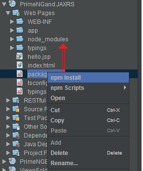

This is a quickstart application for PrimeNG and JAX-RS.

You can run it like this:
- Run "npm install" from command line or from NetBeans like below

	

- Run it under WildFly/GlassFish/etc.

You should obtain something like [this](http://java-ee-articles.blogspot.ro/2016/02/primeng-mvc-10-ozark-ri.html).
