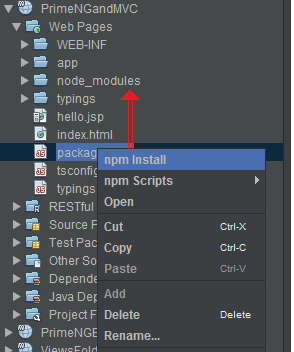

This is a quickstart application for PrimeNG and MVC 1.0 (Ozark RI).

You can run it like this:
- Run "npm install" from command line or from NetBeans like below

	

- Run it under GlassFish 4.1.1 (more details [here](http://java-ee-articles.blogspot.ro/2016/01/rapid-testing-mvc-10-ozark-ri.html))

You should obtain something like [this](http://java-ee-articles.blogspot.ro/2016/02/primeng-mvc-10-ozark-ri.html).
